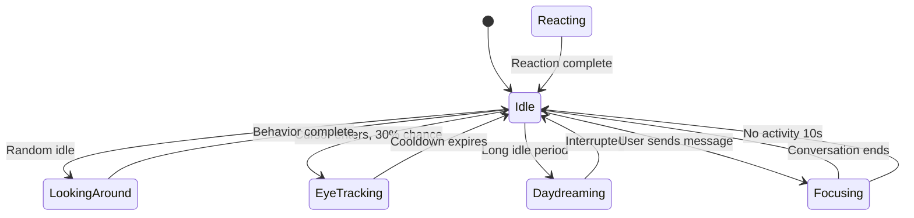

# Echo - Behavior & Animation System

## Overview

Echo is an alive character with **autonomous behaviors** - she moves, reacts, and "lives" on your screen without you controlling her camera.

---

## 🎯 Core Principles

1. **Echo controls her camera** - You cannot rotate; she decides where to look
2. **Sometimes she follows** - Eye tracking happens occasionally, not always
3. **She has moods** - Camera responds to her emotional state
4. **She has a schedule** - Idle behaviors happen throughout the day
5. **Focus mode** - Zooms close during meaningful conversations

---

## 👁️ Eye Following System

### When Does Echo Look at Cursor?

**Probability-based** - She doesn't always look:

```kotlin
object EyeFollowing {
    const val LOOK_PROBABILITY = 0.3f  // 30% chance to look
    const val LOOK_DURATION_MIN = 2000L  // 2 seconds min
    const val LOOK_DURATION_MAX = 5000L  // 5 seconds max
    const val COOLDOWN = 10000L  // 10 seconds between looks
}

fun shouldLookAtCursor(): Boolean {
    return random() < EyeFollowing.LOOK_PROBABILITY && 
           !isInCooldown() &&
           !isBusy() &&
           currentMood !in listOf(SLEEPY, DISTRACTED)
}
```

### Eye Movement Logic

```kotlin
fun updateEyePosition(cursorPosition: PointF) {
    if (shouldLookAtCursor()) {
        // Calculate angle to cursor
        val angle = calculateAngle(characterCenter, cursorPosition)
        
        // Convert to eye offset (-1 to 1)
        val eyeX = cos(angle).clamp(-1f, 1f) * 0.8f
        val eyeY = sin(angle).clamp(-1f, 1f) * 0.8f
        
        // Smooth transition
        animateEyeTo(eyeX, eyeY, duration = 300.ms)
        
        // Also turn head slightly toward cursor
        animateHeadRotation(angle * 0.3f, duration = 500.ms)
        
        startCooldown()
    } else {
        // Look away casually
        lookAwayCasually()
    }
}
```

### Eye States

| State | Eye Position | Occurs When |
|-------|--------------|-------------|
| **Center** | Normal | Default |
| **Tracking** | Following cursor | 30% of time |
| **Looking Away** | To side | Bored, shy |
| **Down** | Looking at hands/things | Thinking |
| **Up** | Daydreaming | Idle |
| **Closed** | Blinking/leeping | Blinking, tired |

---

## 🎬 Focus Mode

When conversation gets meaningful, Echo zooms closer.

### Triggers

```kotlin
data class FocusTrigger(
    val messageLength: Int > 50,  // Long message
    val emotionalWord: Bool,      // "love", "sad", "happy"
    val questionAsked: Bool,      // User asked question
    val deepTopic: Bool,          // Philosophical/personal
    val userTypingPaused: Bool    // User finished typing
)

fun calculateFocusLevel(triggers: List<FocusTrigger>): Float {
    return (triggers.count { it } / triggers.size).coerceIn(0f, 1f)
}
```

### Focus Levels

| Level | Zoom | Effect |
|-------|------|--------|
| **Casual** | 1.0x | Normal distance |
| **Engaged** | 1.2x | Slight zoom |
| **Focused** | 1.5x | Medium zoom |
| **Intense** | 2.0x | Close-up on face |

### Focus Transition

```kotlin
fun animateFocusLevel(targetLevel: Float) {
    val targetZoom = when (targetLevel) {
        in 0f..0.25f -> 1.0f
        in 0.25f..0.5f -> 1.2f
        in 0.5f..0.75f -> 1.5f
        else -> 2.0f
    }
    
    animateZoom(
        target = targetZoom,
        duration = 800.ms,
        easing = CubicBezier.EaseInOut
    )
    
    // Also adjust vertical position for close-up
    animatePosition(
        y = targetZoom * -20f,  // Move up when zooming
        duration = 800.ms
    )
}
```

---

## 🌀 Idle Behaviors

Echo has a schedule of autonomous behaviors when not interacting.

### Behavior Schedule

```kotlin
object IdleBehaviors {
    const val MIN_INTERVAL = 5000L   // 5 seconds between
    const val MAX_INTERVAL = 15000L  // 15 seconds max
    const val BEHAVIOR_CHANCE = 0.4f // 40% chance each interval
}

val idleBehaviors = listOf(
    LookAroundRoom(),
    BlinkCheck(),
    StretchArms(),
    AdjustPosture(),
    DaydreamLook(),
    CheckPhoneGesture(),
    SighSoftly(),
    HumQuietly(),
    ShiftWeight(),
    PlayWithHair()
)
```

### Example Idle Behaviors

#### 1. Look Around Room
```kotlin
object LookAroundRoom : IdleBehavior("LookAround", weight = 3) {
    override suspend fun execute() {
        // Look left
        animateHeadRotation(-30f, duration = 1000.ms)
        wait(1500)
        
        // Look center
        animateHeadRotation(0f, duration = 800.ms)
        wait(500)
        
        // Look right
        animateHeadRotation(30f, duration = 1000.ms)
        wait(1500)
        
        // Return to center
        animateHeadRotation(0f, duration = 800.ms)
    }
}
```

#### 2. Daydream
```kotlin
object DaydreamLook : IdleBehavior("Daydream", weight = 2) {
    override suspend fun execute() {
        // Look up and away
        animateEyePosition(0f, 0.8f)  // Eyes up
        animateHeadRotation(-10f, duration = 1500.ms)
        
        // Slight smile
        animateMouthShape("smile", intensity = 0.3f)
        
        wait(3000)
        
        // Return to normal
        animateEyePosition(0f, 0f)
        animateHeadRotation(0f, duration = 1000.ms)
        animateMouthShape("neutral")
    }
}
```

#### 3. Stretch
```kotlin
object StretchArms : IdleBehavior("Stretch", weight = 1) {
    override suspend fun execute() {
        // Arms up stretch
        playAnimation("arms_up", duration = 2000.ms)
        
        // Small bounce
        animatePosition(y = -10f, duration = 300.ms)
        animatePosition(y = 0f, duration = 300.ms)
        
        // Satisfied expression
        setExpression("happy")
        wait(1000)
        
        // Return to idle
        playAnimation("arms_down", duration = 1500.ms)
    }
}
```

#### 4. Check Phone (Looking at notification area)
```kotlin
object CheckPhoneGesture : IdleBehavior("CheckPhone", weight = 2) {
    override suspend fun execute() {
        // Look toward notification area (usually top-right)
        animateHeadRotation(45f, duration = 800.ms)
        animateEyePosition(0.5f, 0.3f)
        
        // Curious expression
        setExpression("curious")
        
        wait(2000)
        
        // Look back
        animateHeadRotation(0f, duration = 600.ms)
        animateEyePosition(0f, 0f)
        setExpression("neutral")
    }
}
```

---

## 🎭 Mood-Based Camera

Each mood has a **default camera position** and **behavior style**.

### Mood Camera Settings

| Mood | Zoom | Pan | Tilt | Behavior |
|------|------|-----|------|----------|
| **Happy** | 1.0x | Center | 0° | Bouncy, animated |
| **Sad** | 0.9x | Slight down | -2° | Slow, droopy |
| **Excited** | 1.1x | Center | +1° | Jumpy, fast |
| **Loving** | 1.2x | Up close | 0° | Soft, gentle |
| **Thinking** | 1.0x | Left/right pan | 0° | Pauses, looks around |
| **Surprised** | 1.3x | Slight back | 0° | Frozen, eyes wide |
| **Embarrassed** | 0.95x | Look away | -1° | Avoids eye contact |
| **Bored** | 0.9x | Drift around | 0° | Slow, distracted |
| **Tired** | 0.85x | Droopy | -3° | Slow blinks, still |
| **Curious** | 1.0x | Tilt toward | +1° | Leans in |

---

## 🎬 Reaction Animations

### Instant Reactions (No User Control)

| Trigger | Animation | Camera Effect |
|---------|-----------|---------------|
| **New message** | Look at chat area | Pan toward text |
| **User typing** | Watch input | Follow cursor occasionally |
| **Sound notification** | Ear twitch | Turn toward sound |
| **Long silence** | Look around | Check if user there |
| **User away** | Wait, then idle | Return to idle behaviors |

### Example: New Message Reaction

```kotlin
fun onNewMessage(message: Message) {
    // Quick reaction sequence
    sequence {
        // 1. Notice (eyes widen)
        animateEyeOpen(1.0f, duration = 100.ms)
        
        // 2. Turn toward chat (camera pan)
        animateCameraPan(
            target = chatAreaCenter,
            duration = 300.ms,
            easing = CubicBezier.EaseOut
        )
        
        // 3. Read expression
        setExpression("neutral_attentive")
        
        // 4. Return to idle after reading
        delay(1500)
        animateCameraReturn(duration = 500.ms)
        setExpression("neutral")
    }
}
```

---

## 🎮 Interaction System

### Touch Interactions (Mobile) / Click Interactions (Desktop)

| Interaction | Echo's Reaction | Camera Effect |
|-------------|-----------------|---------------|
| **Tap/Click** | Look at cursor briefly | Small pan toward |
| **Double Tap** | Surprised expression | Quick zoom out |
| **Long Press** | Happy, blush | Zoom in slightly |
| **Pet/Caress** | Close eyes, smile | Soft zoom, gentle sway |
| **Shake** | Confused expression | Camera shake |
| **Poke** | Flinch, look at poke point | Quick pan to point |

---

## 🔧 Implementation Classes

### Camera Controller

```kotlin
class CameraController {
    var zoom: Float by mutableStateOf(1f)
    var pan: PointF by mutableStateOf(PointF.Zero)
    var tilt: Float by mutableStateOf(0f)
    var targetZoom: Float by mutableStateOf(1f)
    var targetPan: PointF by mutableStateOf(PointF.Zero)
    
    fun animateTo(
        zoom: Float = this.zoom,
        pan: PointF = this.pan,
        tilt: Float = this.tilt,
        duration: Duration,
        easing: Easing = CubicBezier.EaseInOut
    ) { /* Animation logic */ }
}
```

### Behavior Engine

```kotlin
class EchoBehaviorEngine(
    private val camera: CameraController,
    private val character: CharacterController
) {
    private val behaviorTree = BehaviorTree()
    
    init {
        // Build behavior tree
        behaviorTree.root = Sequence(
            // Priority 1: Reactions (always check first)
            ReactToMessage(),
            ReactToUserInput(),
            ReactToNotifications(),
            
            // Priority 2: Focus mode
            AdjustFocusLevel(),
            
            // Priority 3: Mood behaviors
            MoodBasedBehavior(),
            
            // Priority 4: Idle (lowest priority)
            IdleBehaviorSelector()
        )
    }
    
    fun update(deltaTime: DeltaTime) {
        behaviorTree.tick(deltaTime)
    }
}
```

---

## 📊 State Machine



---

## 🎯 Randomization

To make Echo feel alive, everything has **probability**:

```kotlin
// Don't be too predictable
object Randomization {
    const val IDLE_BEHAVIOR_CHANCE = 0.4f      // 40% chance
    const val EYE_TRACKING_CHANCE = 0.3f       // 30% chance
    const val LOOK_AWAY_CHANCE = 0.25f         // 25% chance
    const val BLINK_INTERVAL_MIN = 2000L       // 2-5 seconds
    const val BLINK_INTERVAL_MAX = 5000L
}

// Add noise to animations
fun addAnimationNoise(value: Float, amount: Float = 0.1f): Float {
    return value + (random() - 0.5f) * amount
}
```

---

## ✅ Summary

| Feature | User Control | Echo Control |
|---------|--------------|--------------|
| Eye following | No | Sometimes (30%) |
| Focus zoom | No | Yes (auto) |
| Idle behaviors | No | Yes (schedule) |
| Mood reactions | No | Yes |
| Message reactions | No | Yes |

Echo is **alive** - she decides when to look, when to focus, and when to idle. You just chat with her! 💕
